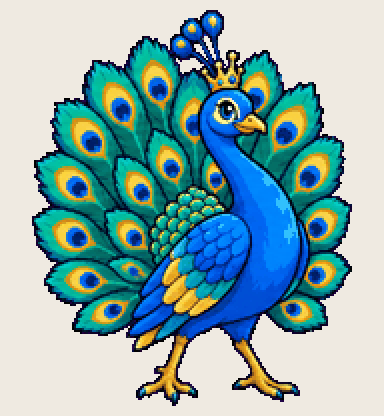

# Bikeshed Peacock

three hours on the button color, the actual feature still unbuilt

Install: copy this folder to `~/.codex/pets/bikeshed-peacock/` (Windows: `%USERPROFILE%\.codex\pets\`), then Codex > Settings > Appearance > Pets > refresh.

Made with [Hatchery](https://3ps.online/pets/). Not affiliated with OpenAI.
