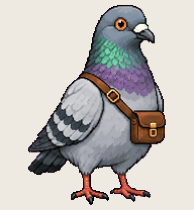

# Courier Pigeon

takes the note from your phone to the right folder every ten minutes

Install: copy this folder to `~/.codex/pets/courier-pigeon/` (Windows: `%USERPROFILE%\.codex\pets\`), then Codex > Settings > Appearance > Pets > refresh.

Made with [Hatchery](https://3ps.online/pets/). Not affiliated with OpenAI.
