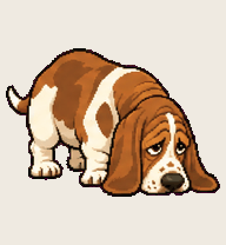

# Notfound Hound

very good nose, very bad memory, the file was never there

Install: copy this folder to `~/.codex/pets/notfound-hound/` (Windows: `%USERPROFILE%\.codex\pets\`), then Codex > Settings > Appearance > Pets > refresh.

Made with [Hatchery](https://3ps.online/pets/). Not affiliated with OpenAI.
