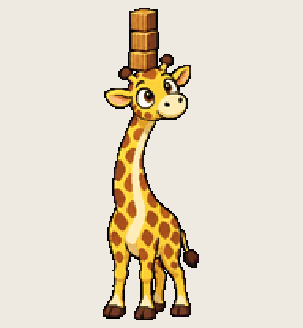

# Overflow Giraffe

stacks one block too many, every single time, on purpose

Install: copy this folder to `~/.codex/pets/overflow-giraffe/` (Windows: `%USERPROFILE%\.codex\pets\`), then Codex > Settings > Appearance > Pets > refresh.

Made with [Hatchery](https://3ps.online/pets/). Not affiliated with OpenAI.
