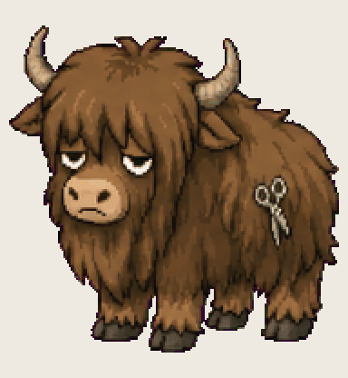

# Shave Yak

four side quests into a refactor before it remembers the original ticket

Install: copy this folder to `~/.codex/pets/shave-yak/` (Windows: `%USERPROFILE%\.codex\pets\`), then Codex > Settings > Appearance > Pets > refresh.

Made with [Hatchery](https://3ps.online/pets/). Not affiliated with OpenAI.
