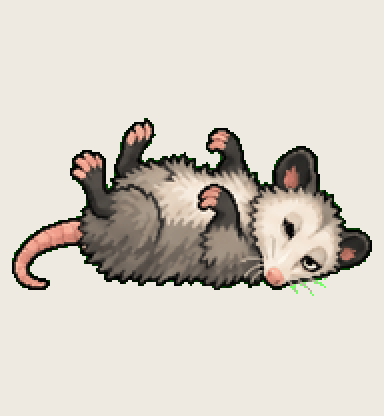

# Zombie Possum

the child process that outlived its parent and kept right on running

Install: copy this folder to `~/.codex/pets/zombie-possum/` (Windows: `%USERPROFILE%\.codex\pets\`), then Codex > Settings > Appearance > Pets > refresh.

Made with [Hatchery](https://3ps.online/pets/). Not affiliated with OpenAI.
